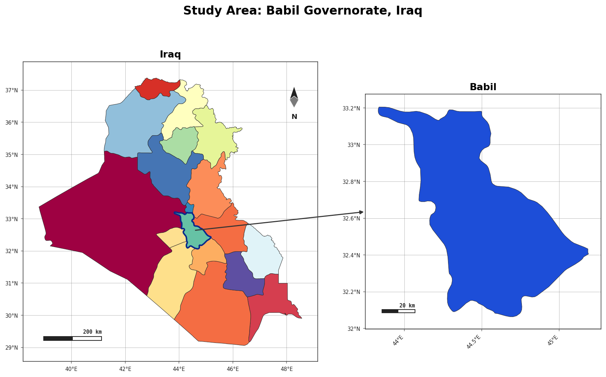
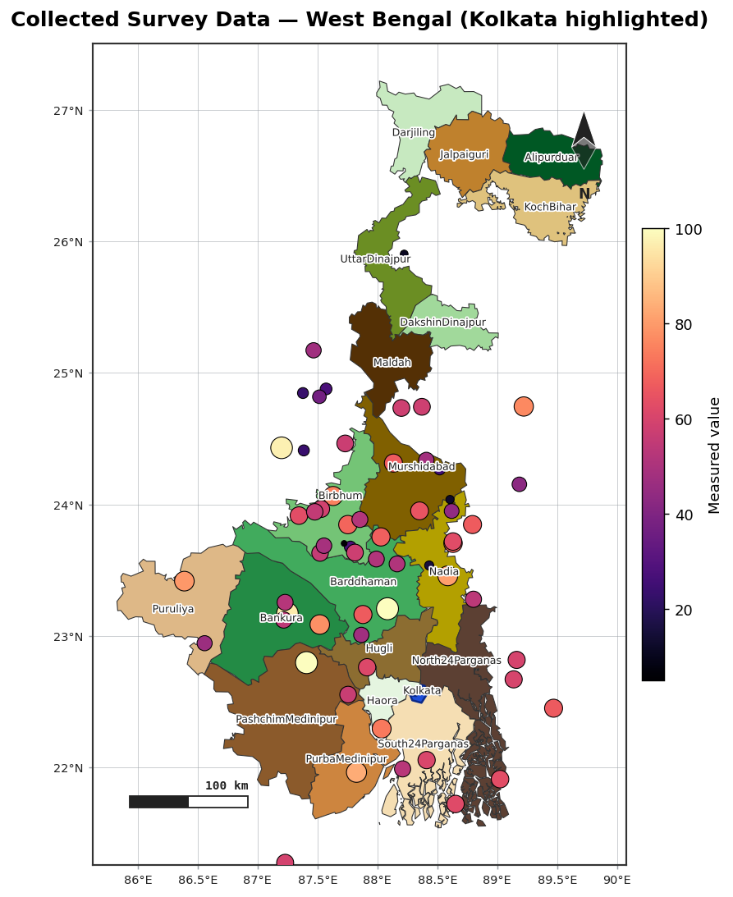
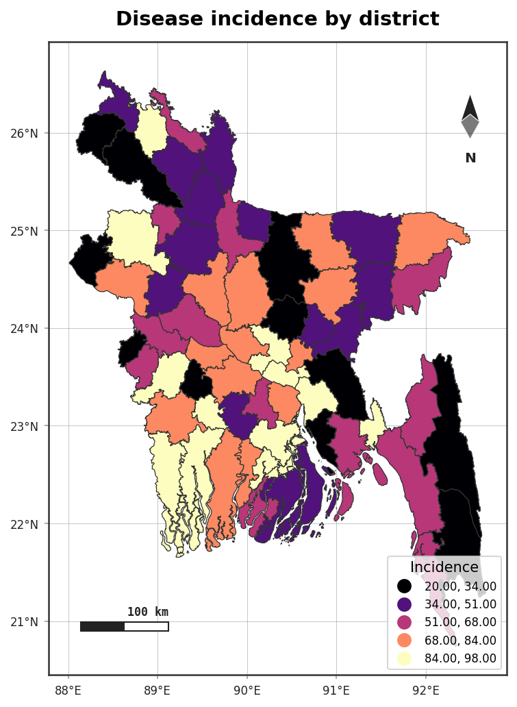
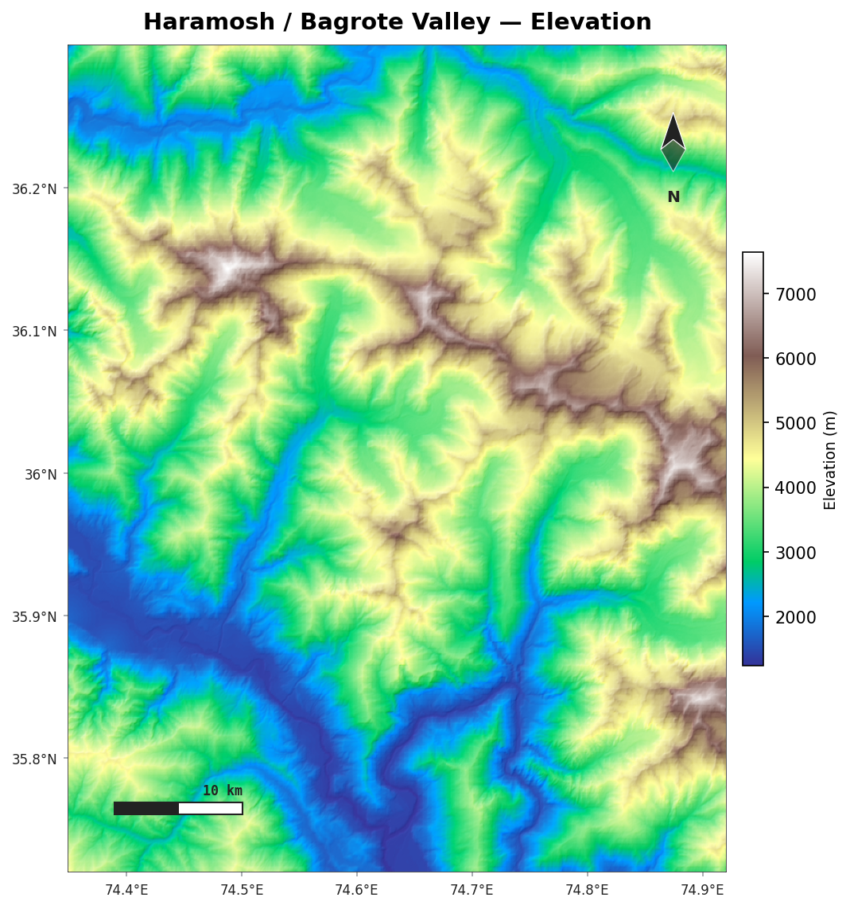
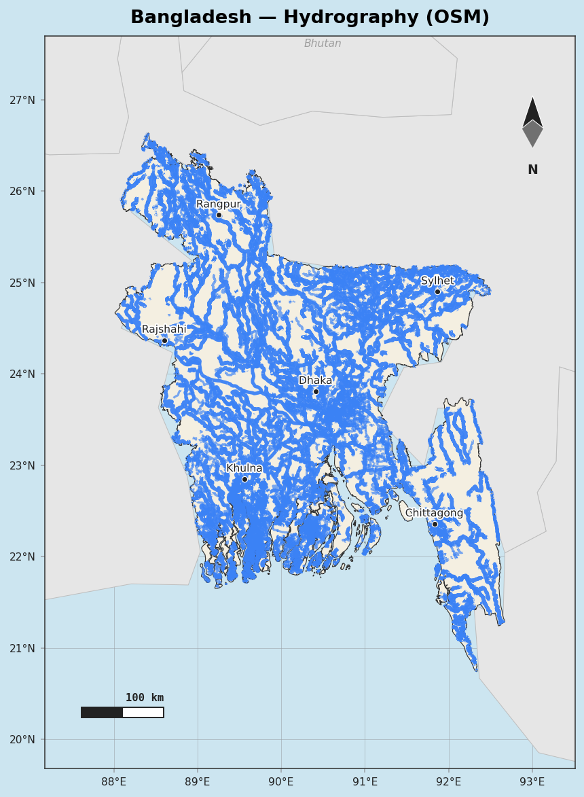
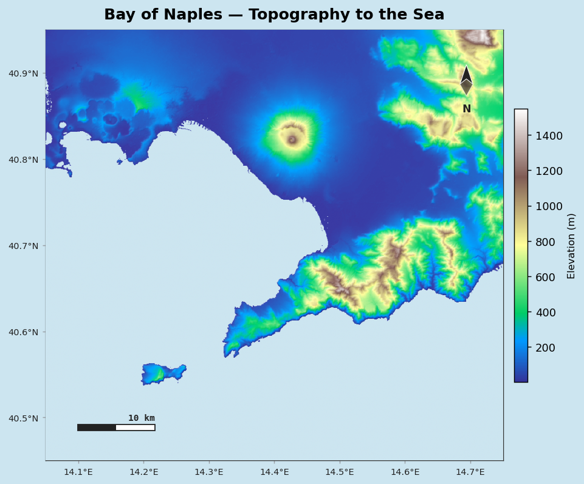
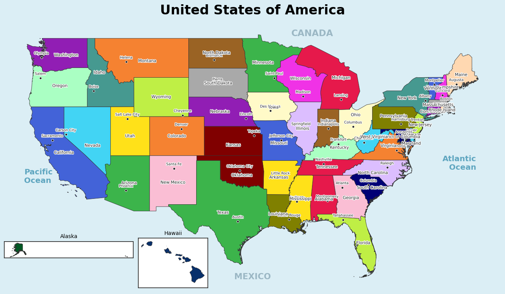
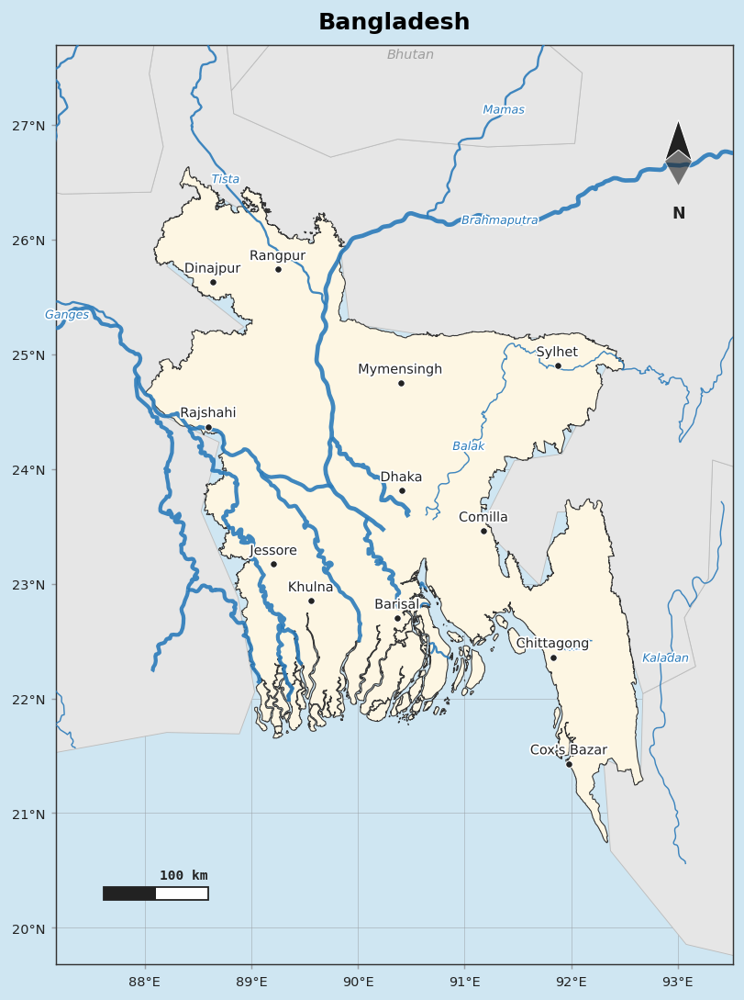
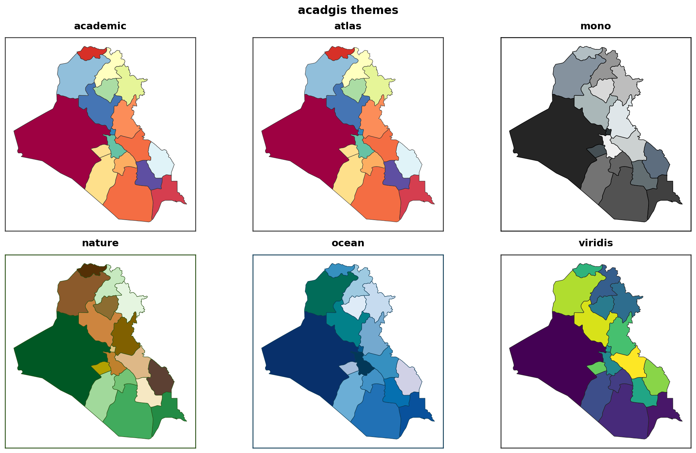

<div align="center">


<br><br>

[](https://pypi.org/project/acadgis/)
[](https://pypi.org/project/acadgis/)
[](LICENSE)
[](https://geopandas.org)
[](https://doc.acadgis.com)

<!-- After publishing to PyPI and making the repo public, swap to live badges:
[](https://pypi.org/project/acadgis/)
[](https://pypi.org/project/acadgis/)
[](https://github.com/riponcm/AcadGIS/stargazers)
-->

### Publication-ready study area maps for research — in a few lines of Python

**[Website](https://acadgis.com)** &nbsp;&middot;&nbsp; **[Documentation](https://doc.acadgis.com)** &nbsp;&middot;&nbsp; **[PyPI](https://pypi.org/project/acadgis/)** &nbsp;&middot;&nbsp; **[Changelog](CHANGELOG.md)** &nbsp;&middot;&nbsp; **[Quick start](#quick-start)**

</div>

---

AcadGIS is a Python package (and a no-code web app) for making **publication-ready study area
maps, choropleth maps, locator insets, terrain relief and river maps** — for research papers,
theses and reports. Name a place, add your data, and export a journal-ready figure: no QGIS,
ArcGIS or shapefiles required.

```python
import acadgis as agis

sa = agis.StudyArea("Iraq").zoom_into("Babil")
sa.figure(suptitle="Study Area: Babil Governorate, Iraq")
sa.save("study_area.png", dpi=300)
```

Prefer no code? The companion web app at **[acadgis.com](https://acadgis.com)** offers the
same figures with interactive editing — in the browser.

---

## Install

```bash
pip install acadgis                    # core (offline demo data + plotting)
pip install "acadgis[full]"            # + live download, fuzzy matching, terrain, drainage
```

| Extra | Adds | For |
|-------|------|-----|
| `acadgis[download]` | `pygadm` | live boundary download for any country |
| `acadgis[match]` | `rapidfuzz` | fuzzy name matching |
| `acadgis[terrain]` | `rasterio`, `rioxarray` | DEM shaded relief / elevation maps |
| `acadgis[drainage]` | `pysheds` | stream networks from a DEM |
| `acadgis[full]` | everything above + `mapclassify` | the lot |

Bangladesh, Iraq, India and the USA ship bundled, so you can try everything offline. One
import gives you the whole stack: `agis.plt`, `agis.np`, `agis.pd`, `agis.gpd`.

---

## Gallery

<table>
<tr>
<td width="33%"><br><sub>Locator figure (country to region)</sub></td>
<td width="33%"><br><sub>Collected data &middot; graduated symbols</sub></td>
<td width="33%"><br><sub>Choropleth with name matching</sub></td>
</tr>
<tr>
<td><br><sub>DEM shaded relief</sub></td>
<td><br><sub>Dense OpenStreetMap rivers</sub></td>
<td><br><sub>Topography to the ocean</sub></td>
</tr>
<tr>
<td><br><sub>Poster map with capitals and insets</sub></td>
<td><br><sub>Atlas-style cartography</sub></td>
<td><br><sub>Built-in themes</sub></td>
</tr>
</table>

---

## Quick start

```python
import acadgis as agis

# 1. Boundaries by friendly level name (auto-download + cache)
gdf = agis.load_boundaries("Bangladesh", level="district")
dhaka = agis.load_boundaries("Bangladesh", "district", within="Dhaka")

# 2. A styled map in one call
agis.plot(gdf, palette="spectral", title="Bangladesh — Districts")

# 3. Choropleth from a spreadsheet — messy names welcome (Chittagong matches Chattogram)
agis.choropleth(gdf, df, value="incidence", palette="magma", scheme="natural_breaks")

# 4. Collected data as graduated symbols, study city highlighted
ax = agis.plot(gdf, highlight="Comilla")
agis.points(ax, survey_df, value="value", size_by="value", cmap="magma", legend=True)

# 5. Terrain relief down to a realistic sea
dem = agis.load_dem("Bagrote Valley")
agis.relief(dem, hillshade=True, ocean_color="#cce5f0")

# 6. The signature multi-panel locator
agis.StudyArea("India", context_level="state").zoom_into(
    "West Bengal", detail_level="district").figure()

# 7. ...or the whole layout in one call — pick a template, the rest is automatic
agis.study_area("Bangladesh",
    steps=[("division", "Dhaka"), ("district", "Madaripur")],
    template="cascade", terrain=True)        # single · two · cascade · series · grid
```

Every decoration is customizable — pass `True`/`False`, a style name, or a dict:

```python
agis.plot(gdf,
    north_arrow={"style": "rose", "size": 0.13, "loc": (0.9, 0.85)},
    scale_bar={"style": "stepped", "length_km": 100},
    border={"style": "checker"})
```

---

## What it does

- **Boundaries on demand** — country, state, district and sub-district, by name, from
  [GADM](https://gadm.org); cached after first use.
- **One-line styled maps** — 12 palettes, 6 themes, north arrows (4 styles), scale bars
  (3 styles), checker border, graticule and legend.
- **Choropleths and graduated symbols** with automatic name matching (renames,
  admin-suffixes, diacritics) and `mapclassify` schemes.
- **Locator insets** — the country to region to detail figure with connecting arrows.
- **Layout presets** — `study_area()` builds the whole multi-panel figure in one call:
  `single`, `two`, `cascade`, `series` or `grid`, with uniform or custom panel sizes,
  customizable connectors, per-panel decorations, and region highlighting.
- **Terrain** — shaded relief and hypsometric tint from Copernicus GLO-30 (no API key),
  with realistic land-to-ocean colouring.
- **Hydrology** — Natural Earth or dense OpenStreetMap river networks and water bodies.
- **Drainage** — stream networks extracted from a DEM by flow accumulation.
- **Publication export** — PNG, PDF or SVG at any DPI.

---

## Documentation and tutorials

Full documentation and runnable, step-by-step tutorials live at
**[doc.acadgis.com](https://doc.acadgis.com)**:

- Quick start — load, plot, themes
- Choropleths and name matching
- Study-area locator figures
- World maps and country highlighting
- Customizing decorations (arrows, scale bars, borders)
- Terrain, hydrology and drainage
- Collected-data maps with graduated symbols

---

## Data and attribution

Administrative boundaries: [GADM](https://gadm.org) 4.1 (via
[`pygadm`](https://pypi.org/project/pygadm/)). Terrain: Copernicus GLO-30 (AWS Open Data).
Rivers, water and world layers: Natural Earth and OpenStreetMap (© OpenStreetMap
contributors, ODbL). All free for academic and non-commercial use — please cite the sources
in your work. See [`NOTICE`](NOTICE).

## Citation

```bibtex
@software{acadgis,
  title  = {AcadGIS: publication-ready academic GIS study-area maps},
  author = {Ripon Chandra Malo},
  year   = {2026},
  url    = {https://github.com/riponcm/AcadGIS},
  note   = {Web app: https://acadgis.com}
}
```

## License

[Apache License 2.0](LICENSE) — free to use, modify and distribute, including in academic
work. If AcadGIS helps your research, a citation or a star is appreciated.

<div align="center"><sub>Built on geopandas, matplotlib and shapely — for researchers, by a researcher.</sub></div>
